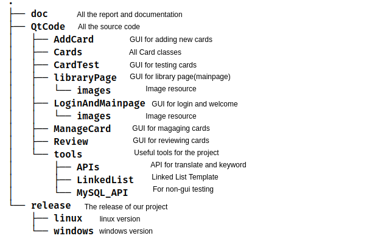
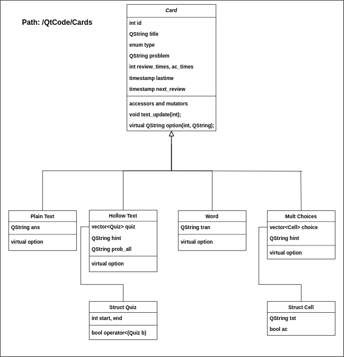
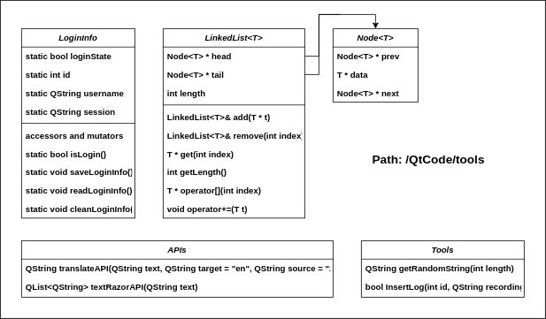
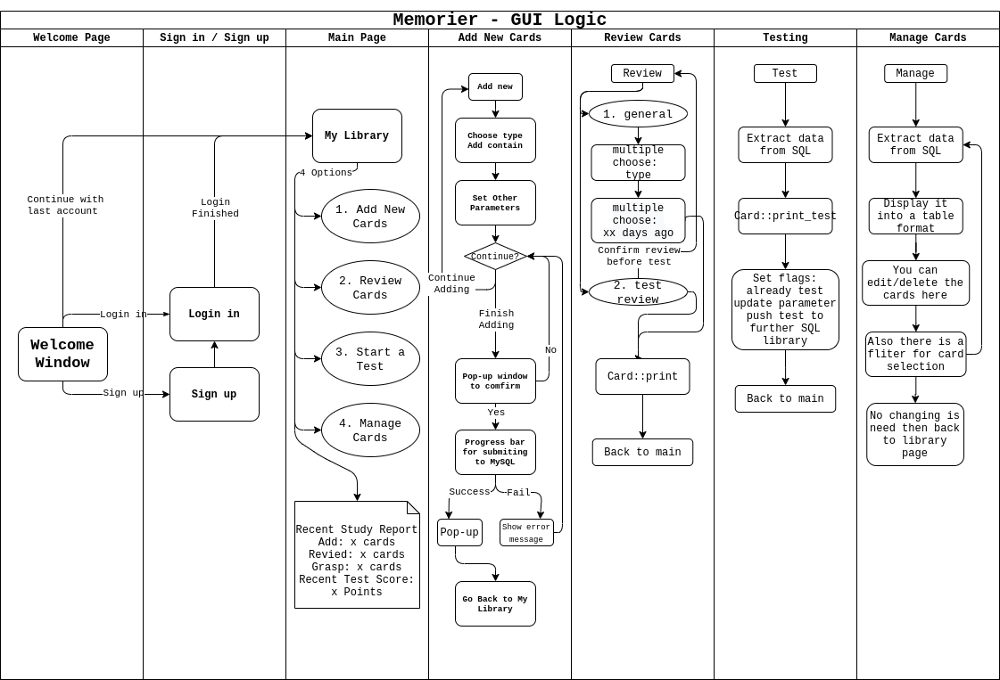
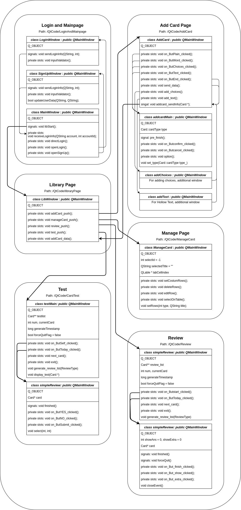
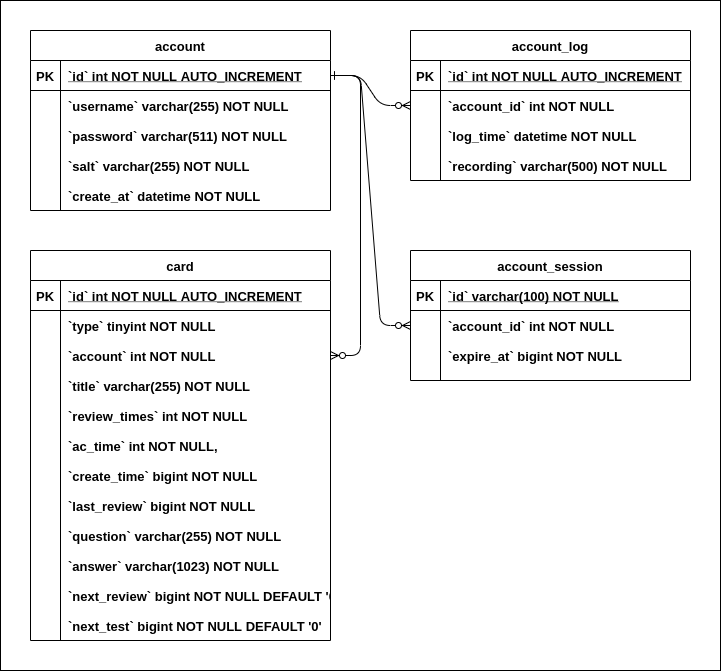

# Memoeier Documentation and Report
### Group: H20 
### Author: ZHANG Zhong & ZHANG Jiekai
- [0. Overview](#0-overview)        
  - [Our Objective](#our-objective) 
  - [The file struct and usage:](#the-file-struct-and-usage)    
- [1. Compile and run the progeam](#1-compile-and-run-the-progeam)    
- [2. How to use Memorier](#2-how-to-use-memorier)    
- [3. Class structure and functions](#3-class-structure-and-functions)        
  - [I. Card class and its drived classes](#i-card-class-and-its-drived-classes)        
  - [II. Tool classes](#ii-tool-classes)        
  - [III. GUI(Qt) classes and GUI login](#iii-guiqt-classes-and-gui-login)    
- [4. Brief description of program design](#4-brief-description-of-program-design)        
  - [I. Use of OOP constructs and techniques](#i-use-of-oop-constructs-and-techniques)        
  - [II. Use of Data Structures](#ii-use-of-data-structures)        
  - [III. Code Reusability](#iii-code-reusability)    
- [5. SQL data structure](#5-sql-data-structure)    
- [6. Future plan](#6-future-plan)
---

## 0. Overview
### Our Objective
#### **Memorier is a learning aid for you, which can help you remember and review better.**  
You can store knowledge in the form of **adding memory cards**, and Memorier will arrange regular **review and test** functions for you.  
The arrangement of reviewing and testing the cards is according to the **forgetting curve** to strengthen your memory of knowledge. Also, we support **custom review and test**. You can select the **type you want** and the **time period** to create the card set and generate a review or test sequence. 
In addition, all your cards will be **automatically synchronized** on your cloud account, which is convenient for multi-device switching.

### The file struct and usage:

## 1. Compile and run the program
- **Important Reminder: If you want to share the code, please delete the database info in [main.cpp](../QtCode/main.cpp)!**
- You can directly use Qt to compile the code.
- Since we are using MySQL database in the code, to run the program, please make sure that you have built the QMYSQL plugin. **There is no integrated support for MySQL plugin in Qt**, you need to download and compile the source code yourself.
- If you would like to know how to compile the MySQL plugin, click [HERE](https://www.codenong.com/cs106162868/) for Linux and [HERE](https://blog.csdn.net/liang19890820/article/details/105071549) for Windows
- **If cannot run the compiled program correctly, there is a release version in the ["relaese"](../release/README.md) folder, you can use that one**

## 2. How to use Memorier
- Log in/Sign up for your account (All your cards will be stored in the cloud, so sign an account is a must)
- Add your card by click "**Add Card**" button on the library page, there are 4 types of cards, we will explain them each later.
- After adding the card you can "**Review**" them, either by their type or by the time you added it. (In the latter case, we will arrange the next review time according to the forgetting curve)
- The "**Test**" function is similar to review, but you need to answer the question in the card and we will record your score for future Review and Test
- In "**Management**" page you can delete or edit(later) your cards, there is a filter for searching cards.

## 3. Class structure and functions  
In this part, we will go through all the important classes and functions used in our project.

### **I. Card class and its drived classes**
Class diagram:  
<!--  -->

* Base class: [Card](../QtCode/Cards/Card.h)  
The **Card** class provide a base class for other cards.  
It contains all the common data members of a class  
  > **Data members**:  
  > * id: the id in of a card in the database (also a unique identifier)  
  > * title: the title of a card  
  > * type: the type of a card (Plain text, Hollow text, Word, Mult choice)  
  > * problem: the problem body of card    
  > * review_times, ac_times: time of reviews and times of correctness in the test  
  > * lastime: last timestamp the card was reviewed   
  > * next_review: next timestamp the card will be reviewed  

  > **Member functions**:  
  > * accessors and mutators: gets and sets
  > * void test_update(int): update the data members after test  
  > * virtual QString option(int option, QString data): all the encoding and decoding functions (for storing/reading the data to/from database)  new functions should be added here
  >   **option id list**:
  >   > * 1 - set answer for this card
  >   > * 2 - set special data for this card
  >   > * 3 - encode to store to database
  >   > * 4 - decode for read from database
  >   > * 5 - get answer for this card (pair with 1)
  >   > * 6 - Butshow text for review
  >   > * 7 - extra button for review
  >   > * 8 - extra output for review (get full answer)
  >   > * 9 - return side-to-side compare version correct answer when test::submit
  >   > * 10 - return noting for side-to-side compare when test::submit

* Drived class1: [Plain Text](../QtCode/Cards/Plain.h)  
The **Plain Text** is for storing a card with only problem and answer  
  > **Data members**:  
  > * ans: storing the answer of the card

  > **Member functions**:  
  > * virtual QString option(int option, QString data): same function as in the base class

* Drived class2: [Hollow Text](../QtCode/Cards/Text.h)  
The **Hollow Text** is for storing a "fill in the blank" card
  > **Data members**:  
  > * quiz: a vector with each element storing one of the "blank" of the text, contains the start and end index.
  > * hint: some hint of the answer
  > * prob_all: encoded problem (for storing in database)

  > **Member functions**:  
  > * virtual QString option(int option, QString data): same function as in the base class

* Drived class3: [Word](../QtCode/Cards/Word.h)  
The **Word** is a card used to recite words and can also do automatically translation  
  > **Data members**:  
  > * tran: storing the translation of the word

  > **Member functions**:  
  > * virtual QString option(int option, QString data): same function as in the base class

* Drived class4: [Mult Choices](../QtCode/Cards/Choices.h)  
The **Mult Choices** is for storing a card with only problem and answer  
  > **Data members**:  
  > * choice: a vector with each element storing one of the "Selection" of the problem  
  > * hint: some hint of the answer  

  > **Member functions**:  
  > * virtual QString option(int option, QString data): same function as in the base class

### **II. Tool classes**
Class/file diagram:  

* **[LoginInfo](../QtCode/tools/LoginInfo.h)**   
The **LoginInfo** class is used to store and read the login info of the user, it will generate a file .session for storing infomation to implement auto login.
  > **Our Login logic**:  
  > 1. **Sign up**: After the user input the password, we will first **generate a random salt** append to the password, and then use the **hash algorithm to encrypt** it. And sent the encrypted password and its salt to the database.
  > 2. **Login**: The program will fetch the **encrypted password and salt** from the database, and hash the password entered by the user append by salt. **If the password after hash is the same, then login success**.
  > 3. **When login success**: The program will **generate a session id and its corresponding expire time**, store it in the local ".session" file and also the database.
  > 4. **Auto Login**: When the next time user open the login window, the program will detect the local ".session" file and **compare it will the session id in the database**, if the **session is the same and not expired**, user can be auto login.  

  > **Data members**:  
  > * static bool loginState: a bool varible used to indicate the login state  
  > * static int id: user's id, used as a nnique identifier
  > * static QString username: username
  > * static QString session: session id

  > **Member functions**:  
  > * accessors and mutators: gets and sets
  > * static bool isLogin(): get login state
  > * static void saveLoginInfo(): save the login infomation to the local ".session" file
  > * static void readLoginInfo(): read the login infomation from the local ".session" file
  > * static void cleanLoginInfo(): clean ".session" file (used when session expired or the session id is not correct)

* **[LinkedList\<T>](../QtCode/tools/LinkedList/LinkedList.h)**  
The **LinkedList\<T>** class is a template class of linked list, used to store our various data, such as cards and MySQL query datas
  > **Data members**:  
  > * Node\<T> * head: the head of the linked list
  > * Node\<T> * tail: the tail of the linked list
  > * int length: the length of the linked list

  > **Member functions**:  
  > * LinkedList\<T>& add(T * t): add a element to the tail (return reference for implementing cascading call)
  > * LinkedList\<T>& remove(int index): remove a specified element (return reference for implementing cascading call)
  > * T * get(int index): get a element by index
  > * int getLength(): get length of the linked list
  > * T * operator: operator overloading, get(index)
  > * void operator+=(T t): operator overloading, add(&t)

* **[APIs](../QtCode/tools/APIs/APIRequest.h)**  
There are two **APIs** we used in our project, one is [translate API](https://www.alapi.cn/doc/show/32.html), another is [keyword extraction API](https://www.textrazor.com/docs/rest).
  > **Functions**:  
  > * QString translateAPI(QString text, QString target = "en", QString source = "zh"): Call translation API, will be used when add/edit "word" type cards for auto translation  
  > * QList\<QString> textRazorAPI(QString text): Call the keyword extraction API, will be used when add/edit a "hollow text" type card for auto selecting keywords  

* **[tools](../QtCode/tools/tools.h)**  
Some commonly used **tools** in programs
  > **Functions**:  
  > * QString getRandomString(int length): generate a random string with certain length, will be used when generate salt and session  
  > * bool InsertLog(int id, QString recording): store the use log to the database, like, login, add card...
  >   > we have a sql table for storing users' log, all the login and card activities will be recorded for safety. For detial please refer to [5. SQL data structure](#5-sql-data-structure).  

* **[selectdate](../QtCode/tools/selectdate.h)**  
This Qt Dialog class is used to select cardtype and timeperiod when generating review and test list.
  > **Member functions**:
  > * Butfinsh_clicked(): generate a QString type selection data and stored in "static QString selection"
  > * void closeEvent(QCloseEvent): together with forceQuitFlag to handle with the close event, make sure the current activity will stop if the user do force quit
  > * static QString get_selection_SQL(): translate the selection data to SQL-style QString. It can be attached to SQL query string directly.

### III. GUI(Qt) classes and GUI login
**Basic GUI logic:**  

**Class diagram:**  

The pages we use:
- Login page  
  **This page is used for login or sign up your account**  
  Before reading the explanation of each function, please make sure you understand our login and sign up strategy:  
  > **Our Login logic**:  
  > 1. **Sign up**: After the user input the password, we will first **generate a random salt** append to the password, and then use the **hash algorithm to encrypt** it. And sent the encrypted password and its salt to the database.
  > 2. **Login**: The program will fetch the **encrypted password and salt** from the database, and hash the password entered by the user append by salt. **If the password after hash is the same, then login success**.
  > 3. **When login success**: The program will **generate a session id and its corresponding expire time**, store it in the local ".session" file and also the database.
  > 4. **Auto Login**: When the next time user open the login window, the program will detect the local ".session" file and **compare it will the session id in the database**, if the **session is the same and not expired**, user can be auto login. 
  - **[LoginWindow](../QtCode/LoginAndMainpage/loginwindow.h)** class:  
    Used for login window
    > * signals: void sendLoginInfo(QString, int): will be emited after the user login successfully. The signal is received by MainWindow  
    > * private slots: void inputValidator(): will be triggered by user input, to check whether the input is vaild.  
  - **[SignUpWindow](../QtCode/LoginAndMainpage/signupwindow.h)** class:  
    Used for sign up an account
    > * signals: void sendLoginInfo(QString, int): same as above  
    > * private slots: void inputValidator(): same as above  
    > * bool updateUserData(QString, QString): add encrypted information to the database  
  - **[MainWindow](../QtCode/LoginAndMainpage/mainwindow.h)** class:  
    Welcome page (I know the class name is bad, but I am too lazy to change it XD)
    > * signals: void libStart(): start the library(main) page  
    > * private slots: void receiveLoginInfo(QString account, int accountId): will be triggered by success of login, save the session file to the database and local ".session" file  
    > * private slots: void directLogin(): handle auto login, will read and check the ".session" file  
    > * private slots: void openLogin(): triggered by push button, open corresponding window  
    > * private slots: void openSignUp(): triggered by push button, open corresponding window  
- Library page  
  **This page is used for main page of Menorier, all your operation after login will begin here**   
  - **[LibWindow](../QtCode/libraryPage/libwindow.h)** class:  
    > * private slots: void addCard_push(): will be triggered by push button, open add card page  
    > * private slots: void manageCard_push(): will be triggered by push button, open manage card page  
    > * private slots: void review_push(): will be triggered by push button, open review page  
    > * private slots: void test_push(): will be triggered by push button, open testing page  
    > * private slots: void addCard_data(): will be triggered by adding one valid card, store the card info to database  
- Add page
- Review page
- Test page
- Manage page  
  **This page is used for manage your existing cards, you can delete/edit them, also there is a fliter for you to select cards**   
  - **[ManageCard](../QtCode/ManageCard/managecard.h)** class:  
    > data member:  
    > * int selectId = -1: indicting which row is selected
    > * QString selectedTitle = "": the title of selected row
    > * QLable * labCellIndex: the label for GUI, showing the selection info to user

    > member functions:  
    > * private slots: void setCostumRows(): will be triggered by the filter, display the cards by user's request  
    > * private slots: void deleteRows(): will be triggered by push button, delete the selected row from database, and refresh the table view  
    > * private slots: void editRow(): will be triggered by push button, open edit page(in progress)  
    > * private slots: void test_push(): will be triggered by push button, open testing page  
    > * private slots: void selectOnTable(): will be triggered by selection on table, change the selectId and selectedTitle, also the label  
    > * void setRows(int type, QString title): query from the database, get the card data needed to set the table, type and title are filter conditions  

## 4. Brief description of program design

### I. Use of OOP constructs and techniques

#### Storing and using data based on inheritence and function overloading

  - A series of classes inherited from the base class (Card) is applied to simplify coding.

  - All managing-related data that is useful for all cards are stored in the base class. The main program can use these data to easily generate card series using different criteria, and it is no need (and should not) to consider what specific type is it.

  - All card type-related functions and data are stored in derived classes. Using function overloading and the powerful QString class, one version of main program is enough to implement all necessary procedures. Specifically, 4 different cards have different “answer type” or even structure to store data, it is tedious to implement the almost-the-same procedure for 4 times in the main program. Therefore, all 4 classes are designed to follow a same protocol to package its data and after sending it to the main program, only one unpackage procedure is needed to apply and data in different types will be transformed into a unified format and can display easily.

  - Through this design, it is very easy to reuse the code or doing further development. More on [Part III code reusability](#iii-code-reusability)

#### Dispersed and well-packed coding

  - As it may cause low efficiency and very likely to go into chaos if two developers kept editing the same file or same function repeatedly, or make the file very large and cause confusion, we tried to disperse the coding mission into small parts and finish them one by one. It turns out that this greatly reduced workload of the project.

  - In considering the two developers’ expertise in different areas, it is decided that all code will be well packed. The other developer can use a pre-set function as a port to easily gain all data who needs. It increases working efficiency and make it easier to reuse the code and do further development.

### II. Use of Data Structures

### III. Code Reusability

## 5. SQL data structure
**SQL structure diagram**:  

 - **account**: store the account infomation, the password here is encrypted. And the id is unique identifier of the user.
 - **account_log**: store the log of every user's activities, including login, add, delete, edit, review, test.
 - **account_session**: store the session id and its expire timestamp, used for auto login and security.
 - **card**: store all the card info and its attributes here.
## 6. Future plan
Yes, This Project Will Continue Even After the Project Period
-  Beautify the UI and add cutscenes or more animation
-  Add image uploading function in cloud server
-  Add setting page (User can config their review time and rules)
-  Ported to mobile phone program, Optimize the touch screen user experience
-  Add label feature to classify cards, let users label their cards for easy sorting and review

